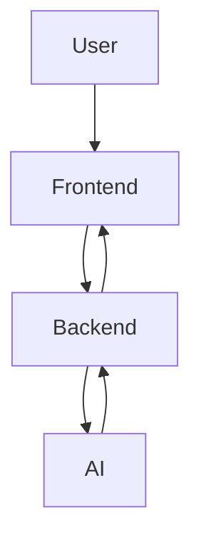

# 🚀 IRIS — Intelligent Retail & Ingredient Scanner

> **AI-powered grocery assistant that turns your lab report into real-time food decisions**

---

## 🎥 Demo

👉 [https://youtu.be/0iLcWrAg5fA](https://youtu.be/0iLcWrAg5fA)

---

## 🔗 Live App

👉 [https://iris-assistant-iu-claude.fly.dev/onboarding](https://iris-assistant-iu-claude.fly.dev/onboarding)

---

## ✨ What IRIS Does

IRIS bridges **personal health data → real-world decisions**.

📋 Upload your lab report
📷 Scan any product
🧠 Get a personalized verdict
🔊 Hear it instantly

**No googling. No guesswork. Just clarity.**
## ⚡ Core Features

### 🧠 Lab Report Intelligence

* Extracts cholesterol, blood sugar, deficiencies, allergies
* Builds a dynamic health profile

### 📷 Real-Time Product Analysis

* Scans ingredient labels using camera
* Returns **Safe / Caution / Avoid** with reasoning

### 🔊 Voice Feedback

* Instant spoken responses via ElevenLabs
* Hands-free shopping experience

### 🔄 Smart Alternatives

* Suggests better product options instantly

### 🛒 Cart Intelligence

* Tracks full cart and summarizes health impact

### 🍽️ Budget Meal Planning

* Aligns health goals with cost

---

## 🏗️ System Architecture

**Architecture Highlights:**

* Multi-modal AI pipeline (Vision + LLM + Voice)
* Real-time decision system
* Handles unstructured inputs (PDFs, images, labels)
* End-to-end full-stack integration

---

## ⚙️ Tech Stack

### 🧠 AI Layer

* Claude (Anthropic) — Vision + reasoning
* ElevenLabs — Voice synthesis

### 💻 Frontend

* React + Vite
* Tailwind CSS

### 🔧 Backend

* Node.js + Express
* API orchestration for AI workflows

---

## 🔄 How It Works

1. Upload lab report → extract health markers
2. Scan product → analyze ingredients
3. Compare with health profile
4. Generate Safe / Caution / Avoid
5. Deliver via UI + voice

---

## 💡 Why This Matters

Most health apps give advice.

IRIS delivers **decisions at the exact moment they matter**.

* Context-aware → personalized to your health
* Real-time → camera + voice
* Decision-first → actionable output

---

## 🚀 Built At

Claude Builder Club Hackathon
Indiana University Bloomington

---

## 👥 Team

* Neeha Agrawal
* Shivali M
* Varun Sonawane
* Aryan Dhuru

---

## ⭐ Highlights

* End-to-end AI system (LLM + Vision + Voice)
* Real-world validation in grocery store
* Handles messy real-world inputs
* Strong product + system design focus

---

## 📬 Let’s Connect

If you're working on **AI, data systems, or product analytics**, I’d love to connect!
